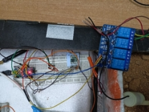
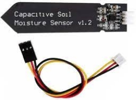
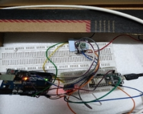
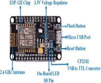
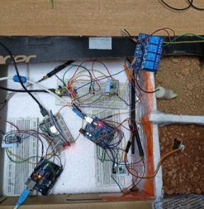



Smart Irrigation Using LoRa 

# **Mrs. Suma Umesh , Arjunagi A Rehman, Avishi Jain , Ayush Kumar, Abhirup Kahyap**
Department of Electrical and Electronics Engineering, BMS Institute of Technology and Management, Bengaluru, Karnataka

***Abstract*** –*As new technologies have been introduced and utilized in modern world, there is a need to bring advancement in the field of agriculture also. Various Researches have been undergone to improve crop cultivation and have been widely used. In order to improve the crop productivity efficiently, it is necessary to monitor the environmental conditions in and around the field. The parameters that has to be properly monitored to enhance the yield are soil characteristics, weather conditions, moisture, temperature, etc., Internet of Things (IOT) is being used in several real time applications. The introduction of IOT along with the sensor network in agriculture refurbish the traditional way of farming. Online crop monitoring using IOT helps the farmers to stay connected to his field from anywhere and anytime. Various sensors are used to monitor and collect information about the field conditions. Collectively the information about the farm condition is sent to the farmer through LoRa WAN technology.*

## **INTRODUCTION**

Use of IoT for the field of agriculture has recently gained popularity. New technologies are being introduced to make farming easy, so that farmers can spend that time for other important works. Mostly, the monitoring and irrigation system can be made automatic and can be controlled remotely. The monitoring data can also be made available for future references and analysis.

The farms can be equipped with automatic monitoring and irrigation systems. This will increase the productivity and also less manual labor would be required. Smart irrigation using LoRa can be implemented and set up in farms with poor network availability too. Its gateway can be placed at a place where network is available, within a range of 10km from farm. 

Once the parameters are set, it would continue working even without being connected to the internet.

The principal expectation of the task is to give farmers an access to the farm remotely and control of various parameters in the farm for irrigation purpose with respect to the type of crops and its requirements. The model contains 

Arduino Uno and different sensors like DHT11 to screen temperature and humidity of soil, a LoRa module to provide wireless connectivity over long range, capacitive soil moisture sensor, ESP8266(Node MCU) for Wi-Fi and a 5V DC motor. This entire model is an IOT based installed framework which senses the deliberate sensor data to AWS cloud and sends back the necessary data to the gateway which accounts for the required actions to be performed .

**LITERATURE REVIEW**

We talk about the smart irrigation frameworks that presently exist or have been proposed giving both their assets and shortcomings. A study on our proposed system is done comparing it with the other smart irrigation systems focusing more on how our system addresses their weaknesses. We likewise do a thorough writing investigation of different parts that are probably going to be utilized in the acknowledgment of our proposed arrangement. The investigation of the parts covers regions like their method of activity, highlights, details, utilizes, applications, benefits and hindrances.

- **Farm Field Monitoring and Irrigation Automation Using IoT**

In this paper it mainly focuses on the irrigation purpose. By working under the mentioned sensors, the irrigation management can be performed perfectly. The collected value from the sensor and the irrigation controller are coordinate with Wi-Fi network. With the help of that specified application, the person can able to know the present situation of the land. Based on the current valuation, the water can be irrigated. As reported by weather forecasting, the water supply can be done to the farm field either periodically or continuously. Here naive Bayes algorithm is used to get the accurate result, the user can get the proper value like how much level of water needs to irrigate. With the guidance of that application, the farmer can build the decision at which condition they want to supply water.

**• Wireless Sensor Network and Internet of   Things (IoT) Solution in Agriculture**

This paper illustrates the automatic irrigation to improve the water conservation. Here RFID and WSN are used along with the ZigBee protocol. In this paper it replaces the function of human to human and human to machine to the Machine to Machine process. If the soil is dry then the RFID based on ZigBee Platform is used to send ID to the reader, then it recognize the node. After that, it sends the exact value of data for irrigation processes without human intervention. The farmer can get the information through system or mobile. Here the water can be supplied throughout the land by sprinkle method. In the automatic irrigation method 50% of the water can be reduced when compared to the manual irrigation. By applying this procedure, the yield of the crop is heightened.

**PROPOSED SYSTEM**

In our proposed system, the soil moisture, humidity and temperature data is being sent to the gateway using LoRa WAN and then it transfers it to the AWS cloud. In AWS data is sent and received using MQTT protocol. In AWS data is sent to DynamoDB for storing and then the processed data is sent to the actuating node through the gateway.

1) ## **System Requirements**
##
- RFM96W LoRa module
- Capacitive Soil Moisture Sensor
- DHT11 Sensor module
- ESP8266 (Node MCU)
- DC motor
- Connecting wires

1) **Working:**

• Sensor node is deployed in ground in the field.

• Capacitive based soil moisture sensor is used which gives analog value.

• As the moisture level changes, dielectric of medium   changes and the sensor senses the change and maps the values between 1 to 1025.

• This value is sent to Arduino UNO which has built-in analog to digital convertor and it stores the data in RAM.

• Once we get the data in Arduino, it is shared with RFM96W which is the LoRa transceiver. It sends the data to gateway using RF communication at 866MHz frequency which comes under ISM band.

• Since ISM band is for everyone to use freely, ‘sync’ word is used to do the synchronization and create channel between gateway and sensing node.

• The Arduino and LoRa module communicate with each other using SPI (Serial Peripheral Interface) protocol which is a full duplex fast communication protocol. So, it is the best fit for transceiver.

• We set the baud rate according to the distance. Higher the baud rate, higher is the speed of communication but lower is the range.

• Since in the field, real time communication is not important, we used low baud rate for longer range.

• The data from sensing node goes to the gateway. The gateway consists of Arduino, Node MCU(ESP8266) and RFM96W LoRa module.

• The gateway first waits for the sensor data, once it starts receiving sensor data, it keeps storing it variables according to the Node IDs.

• Once data reception is completed, data will go to the Node MCU from Arduino using I2C (Inter-Integrated Circuit) communication.

• Here, ESP8266 acts as master and Arduino as slave, so master requests the data every 2 seconds.

• If Arduino doesn’t have new data, it sends old data only.

• Once data reaches ESP8266, it takes the data and also adds temperature and humidity values from DHT11( temperature-humidity sensor)

• ESP8266 has capability to connect to internet using Wi-Fi.

• The data is converted to json format is sent to AWS using MQTT protocol.

• To get the data into AWS, a ‘thing’ is created in AWS IoT and it provides 2 certificates and 1 key for secure connection of device to AWS.

• After reaching AWS, data is stored in DynamoDB (NoSQL database) in key-value pairs.

• Also, at the gateway, the moisture value is compared with the critical value and signal is sent to the actuator node.

•We can set the critical value from AWS by publishing the data at publish topic.

• So, from AWS data goes to ESP8266. ESP8266(master) sends the data to Arduino (slave).

• Arduino saves the critical value locally, so in case if non availability of internet at times, the irrigation system still works properly.

• Based on the critical value, gateway sends on/off signal to actuating nodes. This package consists of ‘Node IDs’ and ‘action.’

• Once data reaches actuating node (LoRa module+Arduino+motor), it reads the data and responds accordingly by switching on the motor or not switching on.

• The time of motor being switched on depends on type of crops, soil and the moisture or water requirements.

**Hardware Requirements**

- **RFM96W RF TRANSCIEVER LoRaTM**

The RFM96W transceivers feature the LoRaTM  long range modem that provides ultra-long range spread spectrum communication and high interference immunity whilst minimising current consumption.Using Hope RF’s patented LoRaTM modulation technique RFM96W can achieve a sensitivity of over -148dBm using a low cost crystal and bill of materials.

**Specifications of  RFM96W LoRaTM**

● Single or Double Center 32-bit LX6 Microchip        with clock recurrence up to 240 MHz.

● 168 dB maximum link budget.

● +20 dBm - 100 mW constant RF output vs. V supply.

● +14 dBm high efficiency PA.

● Programmable bit rate up to 300 kbps.

● High sensitivity: down to -148 dBm.

● Bullet-proof front end: IIP3 = -12.5 dBm.

● Excellent blocking immunity. 

● Low RX current of 10.3 mA, 200 nA register retention.

● Fully integrated synthesizer with a resolution of 61 Hz.

● FSK, GFSK, MSK, GMSK, LoRaTM and OOK modulation.

● Built-in bit synchronizer for clock recovery.

● Module Size：16\*16mm

###
- ### **Capacitive Soil Moisture Sensor**
As the name indicates capacitive moisture sensor is a sensor which senses the moisture in the soil, the moisture in the soil can be measured using two methods resistive and capacitive.

This v1.2 sensor uses capacitive method instead the resistive method which was used in the previous versions of the sensor.

### **Interfacing Capacitive Soil Moisture Sensor with Sensing Node (LoRaTM)**

- ### **ESP8266 (NodeMCU)**
NodeMCU is an open-source Lua based firmware and development board specially targeted for IoT based Applications. It includes firmware that runs on the ESP8266 Wi-Fi SoC from Espressif Systems, and hardware which is based   on the ESP-12 module. 

The NodeMCU ESP8266 development board comes with the ESP-12E module containing the ESP8266 chip having Tensilica Xtensa 32-bit LX106 RISC microprocessor. This microprocessor supports RTOS and operates at 80MHz to 160 MHz adjustable clock frequency. NodeMCU has 128 KB RAM and 4MB of Flash memory to store data and programs. Its high processing power with in-built Wi-Fi / Bluetooth and Deep Sleep Operating features make it ideal for IoT projects.

`	`NodeMCU ESP8266 Specifications & Features

• Microcontroller: Tensilica 32-bit RISC CPU Xtensa LX106

• Operating Voltage: 3.3V

• Input Voltage: 7-12V

• Digital I/O Pins (DIO): 16

• Analog Input Pins (ADC): 1

• UARTs: 1

• SPIs: 1

• I2Cs: 1

• Flash Memory: 4 MB

• SRAM: 64 KB

• Clock Speed: 80 MHz

• USB-TTL based on CP2102 is included onboard,     Enabling Plug n Play

• PCB Antenna

• Small Sized module to fit smartly inside your IoT projects.

- ### **DHT11 Sensor Module**
The DHT11 sensor module consists of a resistive type humidity measurement and NTC temperature measurement components along with an 8 bit-microcontroller. It ensures quality, fast response, anti-interference ability, and cost-effectiveness. The sensor module is precalibrated in the laboratory which makes the end-user to directly use this sensor in their project. The calibrated data is stored in the OTP memory, which is used by the sensor’s internal signal detecting process. It consists of a single-wire serial interface to send the data from the sensor to the microcontroller.

The DHT11 sensor is accessible either as a sensor or as a module. The main distinction in them is that we really want to add a capacitor and a draw up resistor to the sensor physically. On the off chance that you have the sensor module, there is compelling reason need to add additional parts as the sensor module will have them inbuilt. The sensor can quantify from 0C to 50C and stickiness from 20% to 90% with an exactness of ±1°C and ±1%. While coming to the correspondence between the sensor and the microcontroller, the total information transmission is 40 piece. The sensor sends higher information first. The information design for sending in the information is 8bit fundamental RH information +8bit RH information + \*bit T information + 8bit decimal T information + 8bit checksum information. Assuming the information transmission is correct, the check-aggregate ought to be the last 8bit. The beneath fig shows the pinout of the DHT11 sensor. The sensor is extremely famous and we have recently involved DHT11 in other, not many of them resemble Arduino Wireless Weather Station, IoT based Temperate and dampness monitoring, and so on..

- ### `	`**DC Motor**

DC motors are rotary electrical machines that convert electrical energy into mechanical energy (Rotation).

**Software Requirements**

- **ARDUINO IDE**

Arduino is a model stage, based on open source equipment and programming that is easy to utilize. Arduino might read information sources like light from a sensor, a finger on a button, or a tweet, and afterward convert them to yields by creating a sign. Then arduino programming language and arduino programming (IDE) for handling. The Arduino IDE upholds the dialects C and C++ utilizing extraordinary guidelines to sort out code. The Arduino IDE supplies a product library called Wiring from the Wiring project, which gives numerous common information and result strategies.

`        	 `**IMPLEMENTATION OF CODE**

#
# **RESULTS**
#
# 
#
#
# 
#
#
#
#
# **CONCLUSION**
#
The proposed system would be very helpful for farmers. It would save their time and efforts. This time can be used for other important works, thereby increasing the overall efficiency and productivity. This would attract the new generation of people who are no more interested in farming and want to do other jobs. Such people can do their job and also keep an eye on the field. Whenever a crop is grown, more than 60% time is spent in just checking the soil conditions only. This time can be saved and people can concentrate elsewhere. Overall crop production would also increase.
#

## **REFERENCES**
##
1. [https://www.sciencepubco.com/index.php/ijet/article/view/12534/5002]()

1. <https://www.researchgate.net/publication/313746033_Wireless_sensor_network_and_internet_of_things_IoT_solution_in_agriculture>

1. <https://ieeexplore.ieee.org/document/7148526?reload=true>

1. <https://www.sciencedirect.com/science/article/abs/pii/S016816991630117X>

1. <https://circuitdigest.com/microcontroller-projects/iot-based-smart-irrigation-system-using-esp8266-and-soil-moisture-sensor>

1. <https://www.alldatasheet.com/view.jsp?Searchword=Rfm96w%20datasheet&gclid=CjwKCAjwzeqVBhAoEiwAOrEmzYO07jGIXg8gVC8mqIRJ9dFMl-IhjcWSyGxSiK7MNaYDdEIt6yXbahoC0t4QAvD_BwE>

1. <https://docs.arduino.cc/resources/datasheets/A000066-datasheet.pdf>

1. <https://components101.com/development-boards/nodemcu-esp8266-pinout-features-and-datasheet>

